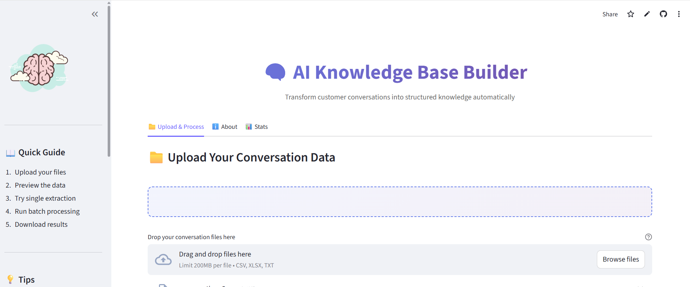
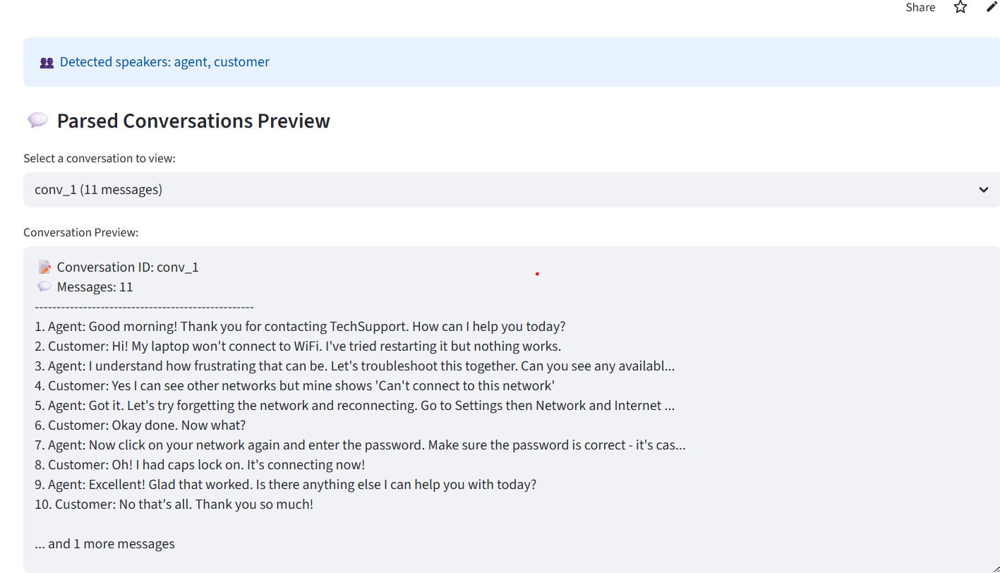
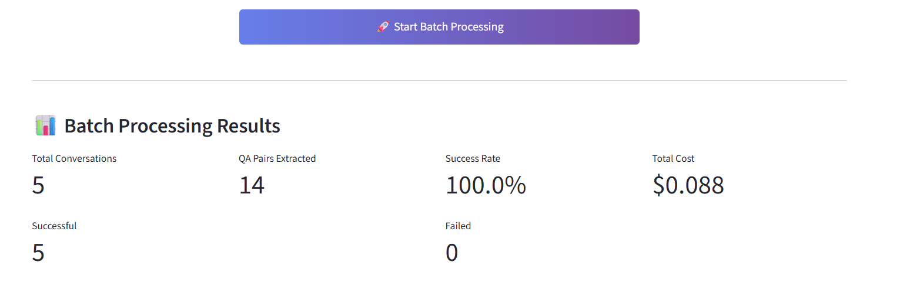
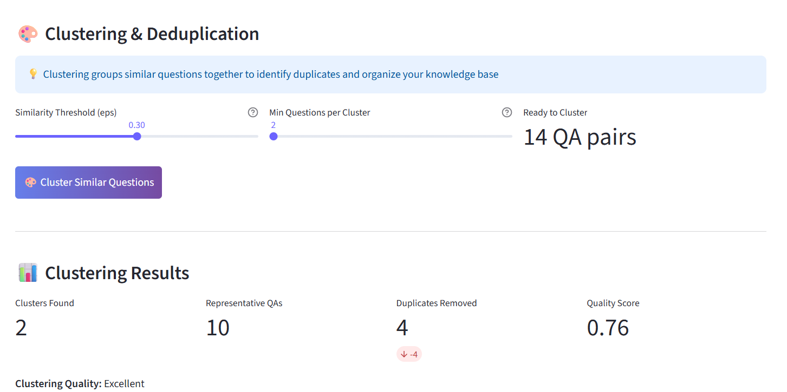
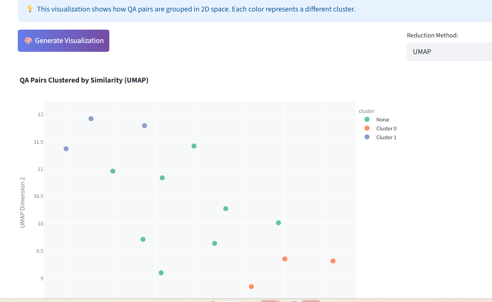

# 🧠 AI Knowledge Base Builder

> Transform customer-agent conversations into structured, searchable knowledge bases automatically using AI

[](https://knowledge-base-builder-wzfflnkq94yfwy8oobeekg.streamlit.app/)
[](https://opensource.org/licenses/MIT)
[](https://www.python.org/downloads/)



## 🎯 Overview

AI Knowledge Base Builder is a production-ready application that automatically extracts question-answer pairs from customer service conversation transcripts using Claude AI, clusters similar questions to remove duplicates, and generates a clean, exportable knowledge base.

**Perfect for:**
- 📞 Contact centers building FAQ databases
- 💬 Customer support teams organizing conversation data
- 🏢 Companies with large conversation archives
- 🤖 Teams implementing AI chatbots that need knowledge bases

## ✨ Key Features

### 🤖 AI-Powered Extraction
- Leverages **Anthropic Claude Sonnet 4.5** for intelligent QA pair extraction
- Automatically identifies information-seeking questions and their answers
- Rewrites questions for clarity and standalone comprehension
- Filters out chitchat, greetings, and non-informational exchanges

### 📁 Multi-Format Support
- Upload **CSV**, **Excel (.xlsx)**, or **Text** files
- Automatic speaker detection (Agent/Customer)
- Smart column identification
- Handles multiple conversations per file

### 🔄 Batch Processing
- Process multiple conversations simultaneously
- Real-time progress tracking
- Cost estimation before processing
- Detailed success/failure reporting

### 🎨 Smart Clustering & Deduplication
- **OpenAI embeddings** for semantic similarity
- **DBSCAN clustering** to group similar questions
- Automatic duplicate detection and removal
- Quality scoring with silhouette analysis
- Reduces redundancy by 20-40% on average

### 📊 Interactive Visualizations
- 2D cluster visualization (UMAP/t-SNE/PCA)
- Interactive scatter plots with hover tooltips
- Cluster distribution charts
- Quality metrics dashboard

### 💾 Multiple Export Formats
- **JSON** - Structured data for APIs
- **CSV** - Easy to import into spreadsheets
- **Markdown** - Human-readable documentation
- Export both full and clustered versions

### 🔍 Search & Filter
- Real-time search across QA pairs
- Filter by source conversation
- Search in both questions and answers

## 🚀 Live Demo

**Try it now:** [AI Knowledge Base Builder](https://knowledge-base-builder-wzfflnkq94yfwy8oobeekg.streamlit.app/)

## 📸 Screenshots

### Conversation Parsing


### Batch Processing Results


### Clustering Analysis


### Interactive Visualization


## 🛠️ Tech Stack

**Framework & UI:**
- [Streamlit](https://streamlit.io/) - Web application framework
- Python 3.9+

**AI & ML:**
- [Anthropic Claude](https://www.anthropic.com/) (Sonnet 4.5) - QA extraction
- [OpenAI](https://openai.com/) (text-embedding-3-small) - Semantic embeddings
- [scikit-learn](https://scikit-learn.org/) - DBSCAN clustering
- [UMAP](https://umap-learn.readthedocs.io/) - Dimensionality reduction

**Data Processing:**
- [Pandas](https://pandas.pydata.org/) - Data manipulation
- [NumPy](https://numpy.org/) - Numerical computing
- [Plotly](https://plotly.com/) - Interactive visualizations

## 📋 How It Works
```mermaid
